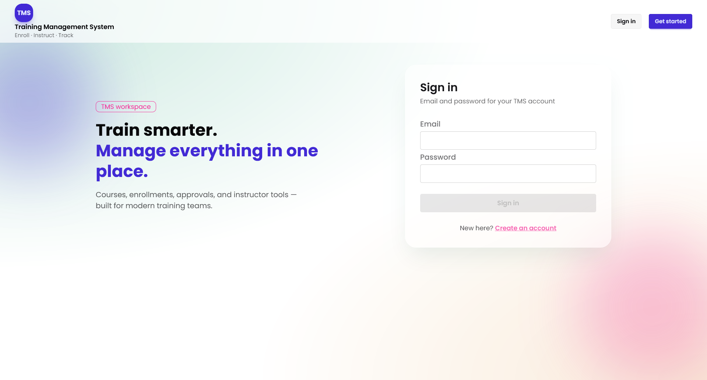
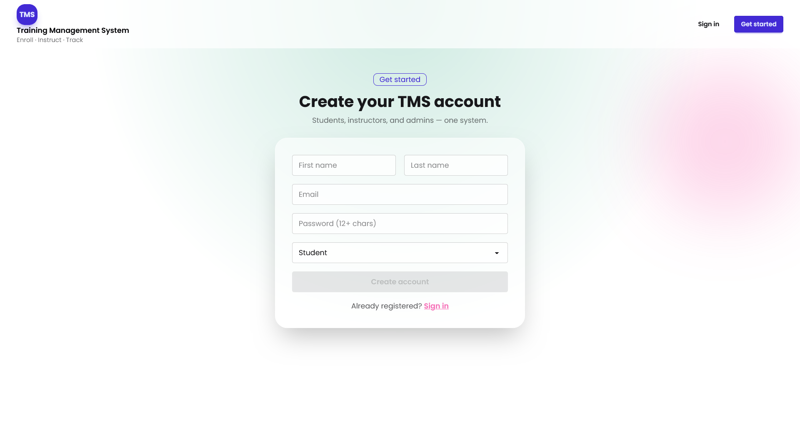
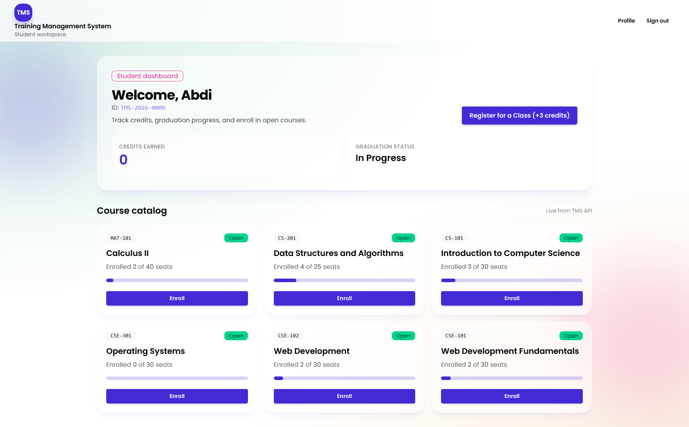
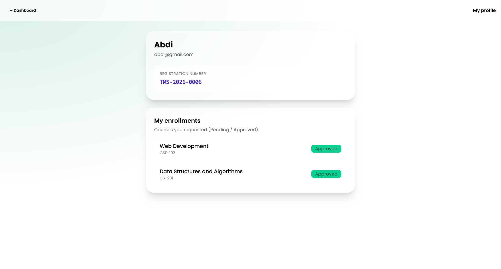
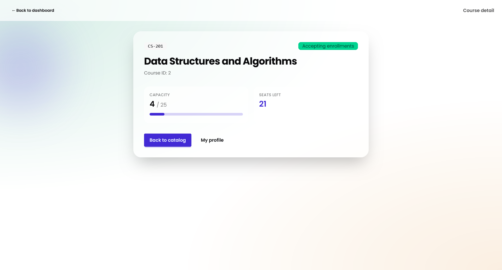
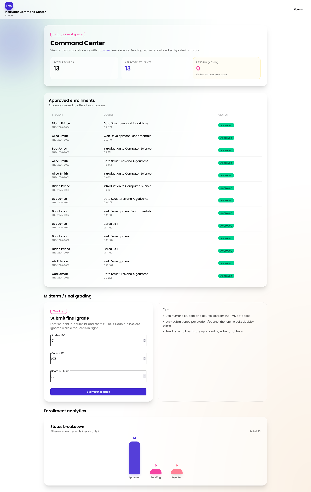
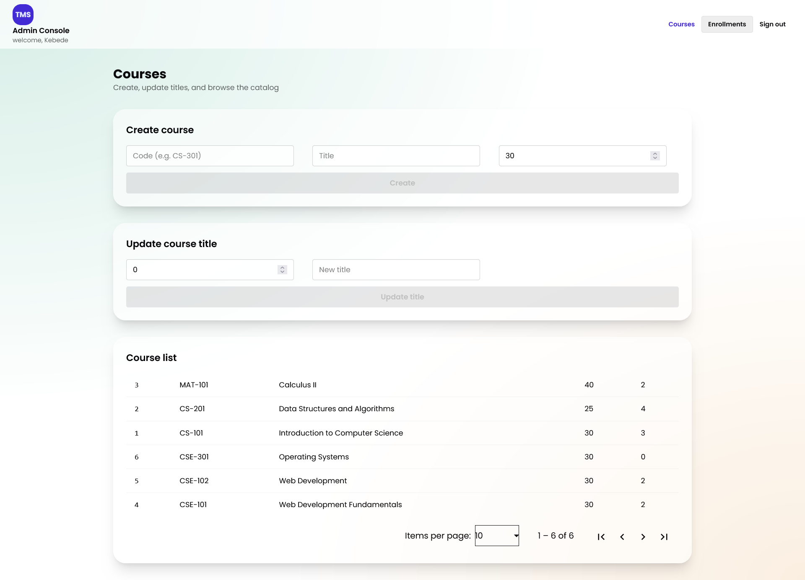
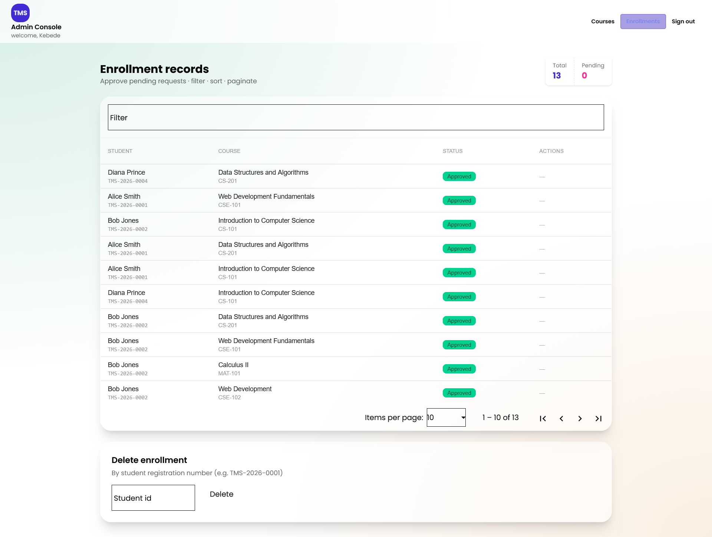
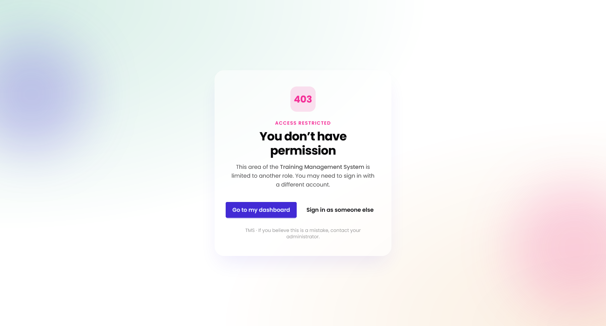

# TMS Client (Angular)

Training Management System — browser application for **Students**, **Instructors**, and **Admins**.

This SPA talks to the ASP.NET Core TMS API (JWT authentication, courses, enrollments, grades).

---

## Stack

| Layer | Choice |
|--------|--------|
| Framework | Angular 22 (standalone components) |
| Styling | Tailwind CSS + daisyUI (glass UI) |
| State | NgRx SignalStore (enrollments) |
| HTTP | `HttpClient` + JWT / error interceptors |
| Tables | Angular Material (`MatTable`, `MatPaginator`, `MatSort`) |
| Tests | Vitest (unit) · Playwright (E2E) |
| Realtime | SignalR client (enrollment status), when API hub is available |

**Design tokens**

| Token | Value |
|--------|--------|
| Primary | `#059669` (Emerald-600) |
| Surface | `#FEFCE8` (Yellow-50) |
| Ink | `#292524` (Stone-800) |
| Accent | `#D97706` (Amber-600) |
| Font | Poppins |

---

## Screenshots

Place PNG files under `docs/screenshots/`. GitHub will render them on this README.

| Page | File | Preview |
|------|------|---------|
| Login | `docs/screenshots/login.png` |  |
| Register | `docs/screenshots/register.png` |  |
| Student dashboard | `docs/screenshots/student-dashboard.png` |  |
| Student profile | `docs/screenshots/student-profile.png` |  |
| Course detail | `docs/screenshots/course-detail.png` |  |
| Instructor command center | `docs/screenshots/instructor-dashboard.png` |  |
| Admin courses | `docs/screenshots/admin-courses.png` |  |
| Admin enrollments | `docs/screenshots/admin-enrollments.png` |  |
| Unauthorized (403) | `docs/screenshots/unauthorized.png` |  |


---

## Features by role

### Student

- Register / login (email + password)
- Automatic student registration number `TMS-2026-00xx` (from API register response)
- Course catalog and enrollment **request** (status **Pending**)
- Profile: registration number and own enrollments
- Course detail page

### Instructor

- Command Center KPIs and deferred analytics chart (`@defer`)
- Roster of **Approved** enrollments only (no approve/reject)
- Grade submission form (RxJS `exhaustMap` to block double-submit)

### Admin

- **Courses:** create (code, title, max capacity), update title by id, paginated list
- **Enrollments:** Material table with filter / sort / paginate, **Approve** pending rows, delete by student registration number

---

## Prerequisites

- Node.js **20+**
- npm
- Running TMS API (default `http://localhost:5013`)

---

## Setup

```bash
npm install
```

### Dev proxy

`proxy.conf.json` should forward `/api` (and `/hubs` if using SignalR) to the API, for example:

```json
{
  "/api": {
    "target": "http://localhost:5013",
    "secure": false,
    "changeOrigin": true
  }
}
```

Ensure `angular.json` → `serve.options.proxyConfig` points at `proxy.conf.json`.

### Environment

Example `src/environments/environment.development.ts`:

```typescript
export const environment = {
  production: false,
  apiUrl: '/api',
};
```

Use a full host (`http://localhost:5013/api`) only if you are not using the proxy; then CORS must allow `http://localhost:4200`.

---

## Run

```bash
ng serve
```

Open [http://localhost:4200](http://localhost:4200).

Restart `ng serve` after changing proxy or Tailwind config.

---

## Main routes

| Path | Description |
|------|-------------|
| `/login` | Sign in |
| `/register` | Create account |
| `/student/dashboard` | Student home + catalog |
| `/student/profile` | Registration number + enrollments |
| `/courses/:id` | Course detail |
| `/instructor/dashboard` | Instructor command center + grades |
| `/admin/dashboard/courses` | Admin courses |
| `/admin/dashboard/enrollments` | Admin enrollments |
| `/unauthorized` | Wrong role / forbidden |

After login, navigation is **role-based** (`Student` → student dashboard, `Instructor` → instructor dashboard, `Admin` → admin dashboard).

---

## Authentication notes

- `POST /api/auth/login` returns `{ accessToken, refreshToken }`
- Access token is held in memory via `AuthService`
- JWT interceptor attaches `Authorization: Bearer <token>`
- Claims used: name identifier (user id), email, role
- Student enroll body uses `sessionStorage` key `tms_student_id` (value like `TMS-2026-0006` from register), not email

---

## Tests

```bash
# Unit tests (Vitest)
npm test

# E2E (Playwright)
# Set credentials for auth setup, e.g. PowerShell:
# $env:TMS_ADMIN_EMAIL="admin@example.com"
# $env:TMS_ADMIN_PASS="YourPassword123!"
npx playwright test
```

Do **not** commit `playwright/.auth/` (session storage state).

---

## Project structure (high level)

```text
src/app/
  features/       login, register, student-*, instructor-*, admin-*, course-detail, unauthorized, grade-submission
  ui/             course-card, analytics-chart, navbar, …
  services/       auth, course, enrollment, grade, …
  store/          enrollment.store (SignalStore)
  guards/         role / auth guards
  interceptors/   jwt, error, …
  models/
docs/
  screenshots/    README page images
```

---

## Related repository

Backend API: **TmsApi** (ASP.NET Core 10 + PostgreSQL + Identity + JWT).

---

## License

Private / coursework — update as appropriate for your institution.
